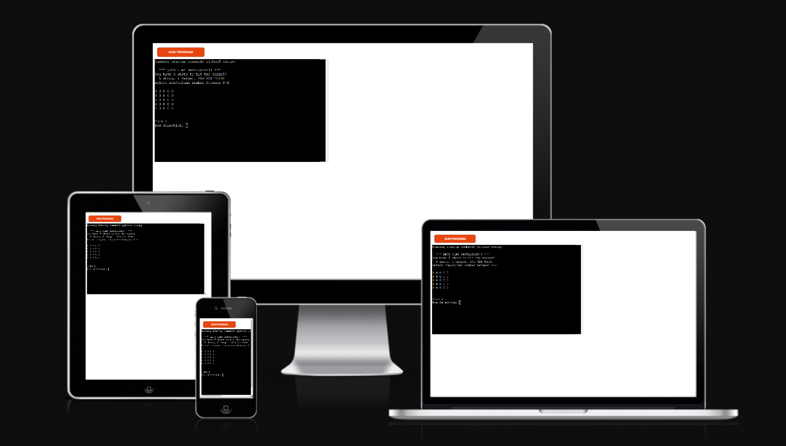
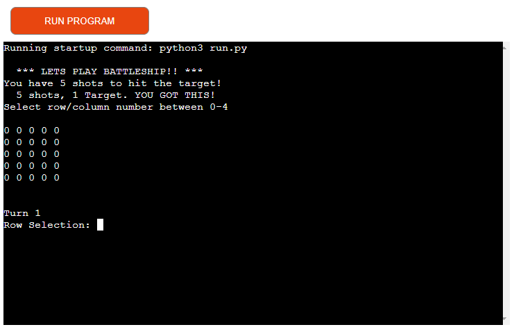

# BATTLESHIP PYTHON GAME

This is a Battleship Game wrote in Python and deployed using HEROKU

## Features 

- __Gameplay__

  The gameplay for Battleship is simple. The player has a total of five turns to sink the one hiding battleship on the board,
  Players will select a row and column and then will be informed wether or not the ship has been sunk.
  The position of the ship is randomly generated each game so there is some replayability to the game.
  If the player guesses outside of the scope of the board, a turn is consumed and they are informed of the error.

 

- __Game Conclusion__

  The player has five turns, if the guess is incorrect then they will be informed and offered another go until all turns have expired.
  If the player guesses the position of the ship correctly then they are informed that they have won.

## Features Left to Implement

Features that I will add in the future include, more ships on the board. and with each hit of the added ships then the player can add shots back to their count.
A scalable playable board that the player can decide on. Better UI for the player, in the games current state I feel the current outline for the board isnt as
visualy pleasing as it could be.

## Testing 

When it came to testing, I debugged the ship position throught the development and logged. I did try to implament a scalable board to the game but due to time
restraints was unable to do so and will have to add in the future.

## Bugs

No significant bugs to note. Did have some issues in regards to if statments although this is just due to me not being accustomed to indentation sensitivity with
Python

### Solved Bugs

Figured out the placment of the statments, like stated above. I am more familiar with languages like Java and C#, so the indentaiton in python took a while to get used too and took some moving around to get right.

## Deployment

Deployment was done with HEROKU. This was achieved by linking my Github account to the site and linking the repository, ensuring that that I had both NODE.JS and Python Buildpacks and setting up Config Vars.

## Credits 

Forums on Stack Overflow
Coffee
